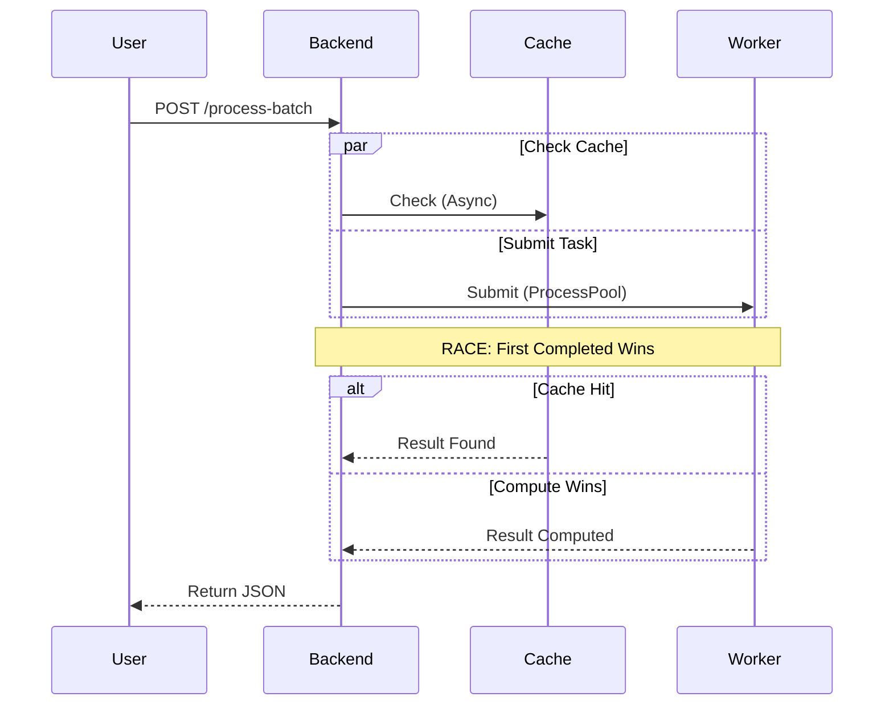

# Planarity Testing & Drug Discovery Platform

A full-stack application for testing graph planarity and analyzing molecular structures (Drug Discovery) using a FastAPI backend and a React/Three.js frontend.

## Features

- **Parallel Graph Processing**: Efficiently process batches of graph strings to test for planarity.
- **Drug Discovery Chat**: Analyze molecular structures (SMILES) and chat with an LLM about their properties.
- **3D Visualization**: Interactive 3D visualization of graphs using Three.js and React Force Graph.
- **Real-time Results**: Streamed results for batch processing using NDJSON.

## System Architecture

The system uses a **Race-to-Result** pattern to ensure low latency, leveraging both caching and parallel computation.

### Request Sequence Diagram




## Workflows

### Planarity Testing
1. **Upload**: User drags a JSON file. `FileUploader` parses it into an edge list string.
2. **API Call**: `POST /process-batch` receives `List[str]`. It creates a SHA256 hash for each graph.
3. **Execution**: `process_graph_task` parses the string into a NetworkX graph and calls `nx.check_planarity(G)`.
4. **Algorithm**: Runs **Boyer-Myrvold**. If non-planar, it extracts the Kuratowski subgraph (K5 or K3,3).
5. **Response**: JSON containing `is_planar`, `nodes`, `edges`, and `execution_time` is streamed back.

### Drug Discovery
1. **Input**: User enters SMILES (e.g., `CC(=O)OC1=CC=CC=C1C(=O)O`).
2. **Analysis**: `drug_discovery.py` uses **RDKit** to:
    - Parse molecule.
    - Calculate MW, LogP, TPSA, etc.
    - Generate 3D coordinates.
3. **AI Insight**: Constructs a prompt with the calculated properties and sends it to **Gemini 2.0 Flash**.
4. **Visualization**: Renders 3D atoms/bonds using `@react-three/fiber`.

## Prerequisites

- **Python**: 3.8 or higher
- **Node.js**: 18 or higher

## Installation

### Backend

1. Navigate to the backend directory:
   ```bash
   cd backend
   ```
2. Install the required Python packages:
   ```bash
   pip install -r requirements.txt
   ```

### Frontend

1. Navigate to the frontend directory:
   ```bash
   cd frontend
   ```
2. Install the Node.js dependencies:
   ```bash
   npm install
   ```

## Usage

To start both the backend and frontend services simultaneously, you can use the provided helper script from the root directory:

```bash
./start.sh
```

Alternatively, you can run them separately:

**Backend:**
```bash
cd backend
uvicorn main:app --reload --port 8000
```
The backend will be available at `http://localhost:8000`.

**Frontend:**
```bash
cd frontend
npm run dev -- --port 3000
```
The frontend will be available at `http://localhost:3000`.

## API Endpoints

- **`POST /process-batch`**: Accepts a list of graph strings and returns planarity test results.
- **`POST /drug-discovery/chat`**: Accepts a molecule (SMILES) or list of molecules and a message to generate an LLM response.
